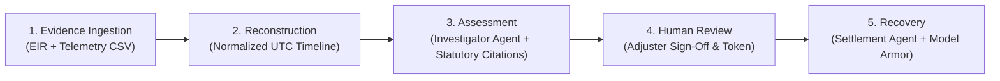
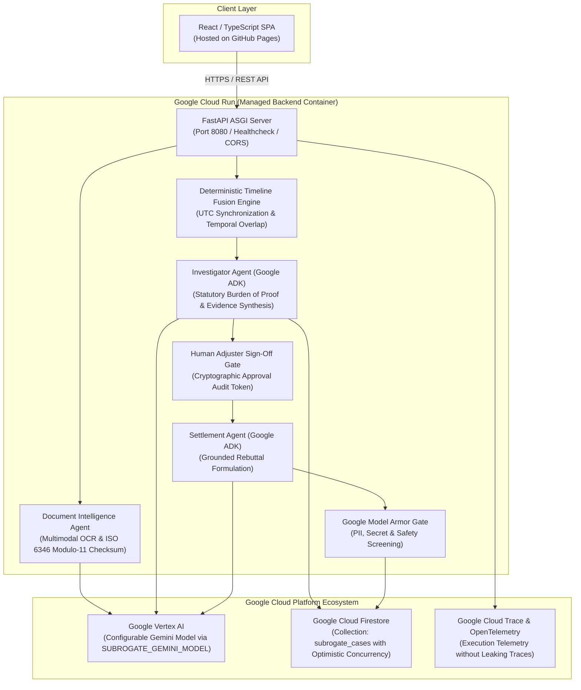

# SubroGate 🛡️
### Agentic Multimodal Forensic Assessment & Autonomous Subrogation Recovery Platform

[](https://opensource.org/licenses/Apache-2.0)
[](https://www.python.org/downloads/)
[](https://react.dev/)
[](https://cloud.google.com/run)
[](https://cloud.google.com/vertex-ai)
[](https://google.github.io/)

**SubroGate** is an enterprise-grade forensic intelligence and subrogation recovery platform designed for commercial freight transit disputes. Built with **Google Vertex AI (Gemini 3.5 / 2.5 / 2.0)**, **Google Agent Development Kit (ADK)**, **Google Model Armor**, **Google Cloud Firestore**, and **Google Cloud Run**, it fuses multimodal Equipment Interchange Receipts (EIRs), Bills of Lading, and IoT sensor telemetry (temperature, 3-axis shock G-force, GPS) into an audit-ready, evidence-backed subrogation recovery package.

---

## 🛑 Problem

Cargo loss, spoilage, and physical damage account for billions in disputed freight claims annually across multimodal shipping lanes. Today, subrogation adjusters face critical operational bottlenecks:

1. **Unstructured Paper & Timestamp Discrepancies**: Gate interchange receipts (EIRs) are often degraded PDFs, faxes, or handwritten physical slips recorded in disparate local time zones (PDT, EDT, UTC).
2. **Disconnected Telemetry**: Calibrated cold-chain sensors and 3-axis accelerometer loggers record continuous time-series data that is rarely mathematically correlated with legal custody handovers.
3. **Slow, Contentious Dispute Cycles**: Carriers default to boiler-plate denials ("Damage existed before pickup", "Notice was untimely", "Sensor was uncalibrated"), dragging claims into multi-month disputes.
4. **Hallucination Risk & Over-Automation**: Generic AI tools hallucinate liability, fabricate legal precedents, or leak sensitive company margins and API keys during carrier correspondence.

---

## 💡 Solution

SubroGate provides an **evidence-backed, mathematically deterministic forensic pipeline** governed by controlled agentic autonomy:

- **Multimodal Document Intelligence**: Ingests scanned receipts, validates ISO 6346 Modulo-11 container checksums, and extracts damage remarks and custody timestamps.
- **Deterministic Timeline Fusion**: Standardizes all time series to UTC and mathematically computes Care, Custody, and Control (CCC) overlap at the earliest recorded breach ($T_{\text{breach}} > T_{\text{interchange}}$).
- **Statutory Burden-of-Proof Synthesis**: Sourced directly under the Carmack Amendment (*49 U.S.C. § 14706*) and Uniform Intermodal Interchange Agreement (*UIIA Section E.2*).
- **Human-in-the-Loop Sign-Off Gate**: Enforces mandatory adjuster review before any external demand or settlement agent unlocks.
- **Google Model Armor Security Screening**: Guards all outbound AI drafts against PII, confidential profit margins, API secrets, and prompt injection attacks.

---

## 🔄 Product Workflow

SubroGate guides the claims adjuster through an intuitive **5-Stage Mental Model**:



1. **Evidence Ingestion**: User uploads any scanned EIR (PDF/PNG/JPG) and calibrated IoT sensor CSV.
2. **Reconstruction**: The system reconstructs a synchronized chronological custody interval timeline.
3. **Assessment**: The Investigator Agent produces an evidence-backed assessment identifying the responsible carrier with statutory citations.
4. **Human Review**: The claims adjuster verifies the evidence, adjusts liability allocation ($0-100\%$), enters notes, and signs the cryptographic approval token (`SIG-AUTH-*`).
5. **Recovery**: The Settlement Agent unlocks to analyze carrier objections, formulate grounded rebuttals, and manage automated dispute negotiation rounds under Google Model Armor screening.

---

## 🏛️ Architecture Diagram



---

## 🤖 Investigator Agent

The **Investigator Agent** is built on Google ADK and Vertex AI Gemini:
- **Multimodal Evidence Correlation**: Ingests extracted receipt data and sensor logs.
- **Mathematical Overlap**: Evaluates custody intervals against threshold breaches (e.g. 4.2G shock pulse and $+12.4^\circ\text{C}$ reefer excursion).
- **Statutory Citations**: Applies strict prima facie carrier liability standards under the Carmack Amendment (*49 U.S.C. § 14706*) and UIIA rules.
- **Strict Legal Boundary**: Formulates an *"Evidence-backed responsibility assessment"* with explicit confidence metrics ($0-100\%$) and legal disclaimers rather than a judicial ruling.

---

## 💼 Settlement Agent

The **Settlement Agent** automates carrier dispute correspondence:
- **Gated Execution**: Cannot be invoked until a human adjuster issues an explicit `APPROVED` audit token.
- **Defense Analysis**: Categorizes inbound motor carrier pushback (*Damage Before Pickup, Untimely Notice, Disputes Custody, Disputes Calibration*).
- **Verifiable Rebuttals**: Drafts formal responses referencing the clean origin EIR outgate remarks and continuous sensor data.
- **Negotiation Simulation**: Evaluates multi-turn counteroffers against pre-approved settlement floors and recovery targets.

---

## 🧩 Google ADK (Agent Development Kit)

SubroGate implements Google's agent patterns:
- **Isolated Tool Schemas**: Deterministic tools for OCR validation, UTC normalization, and custody overlap.
- **Structured JSON Contracts**: Enforces strict Pydantic schemas on all agent outputs.
- **Deterministic Fallback**: In the event of API disruption, agents gracefully operate with deterministic local analysis without failing the server.

---

## ✨ Gemini / Vertex AI Integration

SubroGate configures Gemini through a single centralized environment variable:

```bash
SUBROGATE_GEMINI_MODEL=gemini-3.5-flash
# (or gemini-3.5-pro, gemini-2.5-pro, gemini-2.0-flash)
```

- **Zero Hardcoded Model Names**: The active model is read dynamically from `backend/config.py` and reported transparently through `/health`.
- **Application Default Credentials (ADC)**: When running on Google Cloud Run, SubroGate connects directly to Vertex AI without requiring hardcoded API keys.

---

## 🗄️ Google Cloud Firestore

- **Collection**: `subrogate_cases`
- **Concurrency Control**: Optimistic locking using version integers (`version: int`) to prevent lost updates in multi-adjuster claims workflows.
- **Immutable Audit Trail**: Appends timestamped audit events (`CASE_CREATED`, `ASSESSMENT_ATTACHED`, `HUMAN_APPROVED`, `DRAFT_SCREENED`) to every case record.

---

## ☁️ Google Cloud Run

The backend is packaged in a production-ready multi-stage `Dockerfile`:
- **Lightweight & Secure**: Runs Python 3.12-slim under a non-root `subrogate` user.
- **Dynamic Port**: Binds automatically to Cloud Run's `$PORT` (default 8080).
- **Graceful Shutdown**: Handles `SIGTERM` cleanly.
- **Healthchecks**: Exposes `/health` for automated liveness and readiness probes.

---

## 🌐 GitHub Pages

The React TypeScript SPA is configured for automated deployment to GitHub Pages:
- **Zero Exposed Secrets**: The client communicates solely via REST API with the Cloud Run backend.
- **Dynamic API URL**: Configurable via `VITE_API_BASE_URL`.
- **SPA Routing Support**: Includes `404.html` redirect handler for seamless browser refreshes.
- **Automated CI/CD**: Packaged in `.github/workflows/deploy.yml`.

---

## 🛡️ Security & Google Model Armor

1. **Data Leak Prevention**: Scans generated letters for SSNs, credit cards, confidential company profit margins, and API keys.
2. **Prompt Injection Defense**: Detects and flags adversarial instructions before outbound dispatch.
3. **Audit Privacy**: OpenTelemetry execution traces sanitize internal prompts and prevent model chain-of-thought traces from leaking into client views or public logs.

---

## 💻 Local Development

### 1. Prerequisites
- Python 3.11+ / 3.12+
- Node.js 18+ & npm

### 2. Clone & Setup Backend
```bash
# Clone the repository
git clone https://github.com/malicodes2/SubroGate.git
cd SubroGate

# Copy environment template
cp .env.example .env

# Install Python dependencies
pip install -r backend/requirements.txt

# Start backend server
python scripts/run_backend.py
```

### 3. Setup Frontend
```bash
# Install frontend dependencies
cd frontend
npm install

# Start Vite dev server
npm run dev
```

The frontend will be available at `http://localhost:5173` and automatically proxy API calls to `http://localhost:8000`.

---

## ⚙️ Environment Variables

| Variable | Default | Description |
| :--- | :--- | :--- |
| `SUBROGATE_GEMINI_MODEL` | `gemini-3.5-flash` | Centralized eligible Google Gemini model name. |
| `SUBROGATE_ENV` | `production` | Runtime environment (`development`, `production`, `test`). |
| `SUBROGATE_PORT` | `8080` | Port for FastAPI server (supports dynamic Cloud Run `PORT`). |
| `GEMINI_API_KEY` | *(None)* | Google AI Studio API key (for local development). |
| `GOOGLE_CLOUD_PROJECT` | *(None)* | GCP Project ID (for Vertex AI & Firestore on Cloud Run). |
| `GOOGLE_CLOUD_LOCATION`| `us-central1` | GCP region for Vertex AI. |
| `SUBROGATE_USE_VERTEX` | `true` | Route through Vertex AI (Google ADK). |
| `CORS_ORIGINS` | `https://muhammadasghar0.github.io,http://localhost:5173` | Allowed CORS origins (comma-separated). |

---

## 🚀 Production Deployment

### 1. Deploy Backend to Google Cloud Run
```bash
# Authenticate with Google Cloud
gcloud auth login
gcloud config set project YOUR_PROJECT_ID

# Run deployment script
./scripts/deploy_cloud_run.sh
# (or scripts\deploy_cloud_run.bat on Windows)
```

### 2. Deploy Frontend to GitHub Pages
1. In your GitHub repository, go to **Settings &rarr; Secrets and variables &rarr; Actions**.
2. Add secret `VITE_API_BASE_URL`: `https://subrogate-backend-xxx.a.run.app`.
3. Push to `main` (or run `.github/workflows/deploy.yml`).

---

## 🧪 Testing & Verification

Run the comprehensive test suite locally:

```bash
# Run 112 automated unit & integration tests
python -m pytest backend/tests -v

# Run frontend typecheck & production build
npm run build --prefix frontend
```

---

## ⚠️ Known Limitations

- **GPS Multipath & Tunnels**: GPS coordinates in mountain passes or urban corridors are subject to periodic drift; internal sensor accelerometer logs remain authoritative.
- **Physical Signature Forensics**: Handwriting signature extraction verifies presence and legibility of clerk signatures, but does not perform legal handwriting biometric authentication.
- **Judicial Disclaimer**: SubroGate produces forensic evidence packages for commercial insurance subrogation; it does not replace licensed claims adjusters or legal counsel.

---

## 🔒 Demo Environment Notice

The private demonstration scenario, recorded videos, and personal test fixtures are strictly isolated and excluded from this public repository. SubroGate operates from a clean, empty state upon deployment, allowing any claims adjuster to upload real evidence and execute end-to-end cargo dispute forensic assessments.
