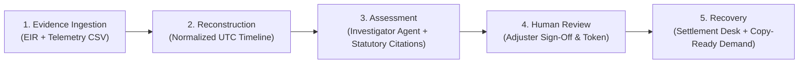
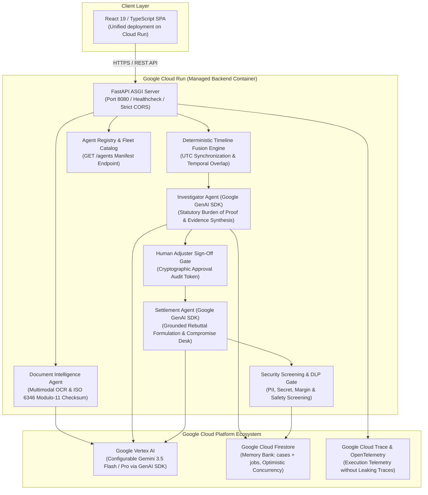

<p align="center">
  
</p>
<h3 align="center">Agentic Incident Reconstruction for Cargo Transit Disputes</h3>

[](https://github.com/malicodes2/SubroGate/actions/workflows/ci.yml)
[](https://opensource.org/licenses/Apache-2.0)
[](https://www.python.org/downloads/)
[](https://react.dev/)
[](https://cloud.google.com/run)
[](https://cloud.google.com/vertex-ai)

**SubroGate** is an institutional-grade **Agentic Incident Reconstruction & Subrogation Recovery Platform** designed for commercial freight transit disputes, strongest in cold chain and high-value freight. Built with **Google Vertex AI (Gemini 3.5)**, the **Google GenAI SDK**, **Google Cloud Firestore (Memory Bank)**, **OpenTelemetry Cloud Trace**, and **Google Cloud Run**, it fuses fragmented physical custody evidence (Equipment Interchange Receipts, Bills of Lading) and continuous IoT sensor telemetry (temperature, 3-axis shock G-force, GPS) into an audit-ready, mathematically deterministic reconstruction of the transit incident to establish liability.

---

## 🌐 Live Demo & Services Health

- **Live Application**: [https://subrogate-backend-zt4kq6xyiq-uc.a.run.app/](https://subrogate-backend-zt4kq6xyiq-uc.a.run.app/)
- **System Health & API Check**: [https://subrogate-backend-zt4kq6xyiq-uc.a.run.app/health](https://subrogate-backend-zt4kq6xyiq-uc.a.run.app/health) *(Validates active connections to Vertex AI, Gemini 3.5, and Firestore)*
- **Agent Fleet Catalog Registry**: [https://subrogate-backend-zt4kq6xyiq-uc.a.run.app/agents](https://subrogate-backend-zt4kq6xyiq-uc.a.run.app/agents) *(Declarative JSON manifest for institutional agent discovery)*

---

## 🛑 Problem

Freight claims cost U.S. shippers over **$50B+ annually** *(CorePiper State of Freight Claims Report; Travelers reports 15% of all cargo claims close with subrogation missed)*, and in **42% of documented transit damage events**, the claim is never formally filed due to evidence reconciliation friction. Today, claims adjusters face critical bottlenecks:

1. **Unstructured Paper & Timestamp Discrepancies**: Gate interchange receipts (EIRs) are often degraded PDFs, faxes, or handwritten physical slips recorded in disparate local time zones.
2. **Disconnected Telemetry & Opposing Sensors**: Calibrated cold-chain sensors and 3-axis accelerometer loggers record continuous time-series data that is rarely mathematically reconciled against carrier gate handovers.
3. **Slow, Contentious Dispute Cycles**: Carriers default to boiler-plate defenses (*"Damage existed before pickup"*, *"Notice was untimely"*, *"Sensor was uncalibrated"*), dragging claims into multi-month disputes.
4. **Data Leakage & Hallucination Risks**: Generic AI tools hallucinate liability, fabricate legal precedents, or leak sensitive profit margins and API keys during carrier correspondence.

---

## 💡 Solution

SubroGate provides an **evidence-backed, mathematically deterministic incident reconstruction pipeline** governed by controlled agentic autonomy:

- **Multimodal Document Intelligence**: Ingests scanned receipts, validates ISO 6346 Modulo-11 container checksums, and extracts damage remarks and custody timestamps.
- **Deterministic Timeline Fusion**: Standardizes all time series to UTC and mathematically computes Care, Custody, and Control (CCC) overlap at the earliest recorded breach ($T_{\text{breach}} > T_{\text{interchange}}$).
- **Statutory Burden-of-Proof Synthesis**: Grounded directly under the Carmack Amendment (*49 U.S.C. § 14706*) and Uniform Intermodal Interchange Agreement (*UIIA Section E.2*).
- **Human-in-the-Loop Sign-Off Gate**: Enforces mandatory adjuster review before any external demand or settlement agent unlocks.
- **DLP & Guardrail Security Screening**: Guards all outbound AI drafts against PII, confidential profit margins, API secrets, and prompt injection attacks.
- **Responsive Adjuster Console**: Full parity from 375px mobile phones to widescreen desktops with drawer navigation, touch targets, and copy-ready demand letters.

---

## 🔄 Product Workflow

SubroGate guides the claims adjuster through a structured **5-Stage Workflow**:



1. **Evidence Ingestion**: Upload scanned EIRs (PDF/PNG/JPG) and calibrated IoT sensor CSV data.
2. **Reconstruction**: Reconstructs a synchronized chronological custody interval timeline.
3. **Assessment**: The Investigator Agent produces an evidence-backed assessment identifying the responsible carrier with statutory citations.
4. **Human Review**: The claims adjuster verifies the evidence, adjusts liability allocation ($0-100\%$), enters notes, and signs the cryptographic approval token (`SIG-AUTH-*`).
5. **Recovery**: The Subrogation Recovery Desk provides copy-ready formal demand notices, pre-drafted carrier rebuttal briefs, and an interactive multi-turn negotiation simulator.

---

## 🏛️ Architecture



---

## 🤖 Agent Registry & Fleet Catalog

Every agent publishes a versioned manifest, discoverable at `GET /agents` and browsable in the UI under **Fleet Catalog**:

| Agent ID | Version | Model Binding | Category | Purpose |
| :--- | :--- | :--- | :--- | :--- |
| `investigator-agent` | `2.0.0` | `gemini-3.5-flash` | `DISPUTE_ARBITRATION` | Multimodal custody extraction, timeline fusion, and Carmack liability calculation. |
| `settlement-agent` | `2.0.0` | `gemini-3.5-flash` | `CLAIMS_RECOVERY` | Formal legal demand formulation, anticipated defense counter-analysis, and compromise negotiation. |
| `document-intelligence-agent` | `2.0.0` | `gemini-3.5-flash` | `DATA_INGESTION` | Optical EIR/BOL ingestion, ISO 6346 Modulo-11 container checksum validation, and SHA-256 fingerprinting. |
| `security-screening-agent` | `2.0.0` | `Rule-Engine / Model Armor` | `COMPLIANCE_AND_SECURITY` | Zero-Trust DLP inspection, PII masking, secret detection, and adversarial prompt injection blocking. |

---

## 🛡️ Security Posture & Guardrails

1. **Authenticated Agent Identity**: State-mutating endpoints enforce Bearer token verification (`SUBROGATE_API_TOKEN`) and Google Cloud authenticated caller identity headers.
2. **Hardened Static Serving**: The SPA fallback strictly resolves and validates path containment within the build root (preventing path traversal). Covered by regression test `test_spa_fallback_rejects_traversal`.
3. **Strict CORS**: Origins are explicitly allow-listed without wildcard credentials.
4. **Data Leak Prevention**: Scans generated letters for SSNs, credit cards, confidential company profit margins, and API keys.
5. **Prompt Injection Defense**: Detects and flags adversarial instructions before outbound dispatch.
6. **Audit Privacy**: OpenTelemetry execution traces sanitize internal prompts and prevent model chain-of-thought traces from leaking into client views or public logs.

---

## 💻 Local Setup & Development

### 1. Prerequisites
- Python 3.11+ / 3.12+
- Node.js 18+ & npm

### 2. Backend Setup
```bash
# Clone the repository
git clone https://github.com/malicodes2/SubroGate.git
cd SubroGate

# Copy environment template
cp .env.example .env

# Install Python dependencies
pip install -r backend/requirements.txt

# Start backend server (defaults to port 8080)
python scripts/run_backend.py
```

### 3. Frontend Setup
```bash
# Install frontend dependencies
cd frontend
npm ci

# Start Vite dev server
npm run dev
```

The frontend will be available at `http://localhost:5173` and proxy API calls to `http://localhost:8080`.

---

## ⚙️ Environment Variables

| Variable | Default | Description |
| :--- | :--- | :--- |
| `SUBROGATE_GEMINI_MODEL` | `gemini-3.5-flash` | Centralized eligible Google Gemini model name. |
| `SUBROGATE_ENV` | `production` | Runtime environment (`development`, `production`, `test`). |
| `SUBROGATE_PORT` | `8080` | Port for FastAPI server (supports dynamic Cloud Run `PORT`). |
| `SUBROGATE_API_TOKEN` | *(Optional)* | Bearer token for Zero-Trust Agent Identity & endpoint protection. |
| `GEMINI_API_KEY` | *(None)* | Google AI Studio API key (for local development). |
| `GOOGLE_CLOUD_PROJECT` | *(None)* | GCP Project ID (for Vertex AI & Firestore on Cloud Run). |
| `GOOGLE_CLOUD_LOCATION`| `us-central1` | GCP region for Vertex AI. |
| `SUBROGATE_USE_VERTEX` | `true` | Route through Vertex AI rather than AI Studio. |
| `SUBROGATE_CORS_ORIGINS` | *(Allow-list)* | Explicit comma-separated allowed CORS origins. |

---

## 🚀 Production Deployment

### 1. Backend & Container (Google Cloud Run)
```bash
# Authenticate with Google Cloud
gcloud auth login
gcloud config set project YOUR_PROJECT_ID

# Run deployment script
./scripts/deploy_cloud_run.sh
# (or scripts\deploy_cloud_run.bat on Windows)
```

### 2. Continuous Integration (GitHub Actions)
All unit tests and frontend builds run automatically on every push via `.github/workflows/ci.yml`.

---

## 🧪 Testing & Verification

```bash
# Run 118 automated unit, security, ADK & integration tests
python -m pytest backend/tests -v

# Run frontend typecheck & production build
npm run build --prefix frontend
```

---

## ⚠️ Known Limitations

- **Telemetry Dependency**: Custody-to-breach correlation requires sensor logger data to exist for the shipment. Document-only reconstruction (BOL/EIR/POD) operates on all freight; telemetry correlation applies where sensors are present.
- **GPS Multipath & Tunnels**: GPS coordinates in mountain passes, marine terminals, or urban canyons are subject to atmospheric drift; internal calibrated accelerometer and temperature logger timestamps remain authoritative.
- **Physical Signature Forensics**: Handwriting signature extraction verifies the presence and legibility of interchange clerk and driver signatures, but does not perform legal biometric signature authentication.
- **Judicial Disclaimer**: SubroGate produces forensic evidence packages for commercial freight claim adjusters and insurers; it does not replace licensed claims adjusters or legal counsel.
