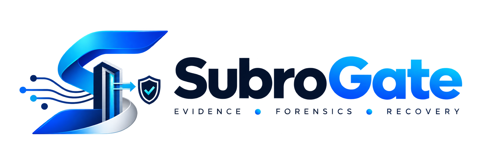
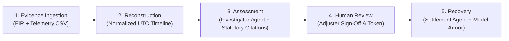
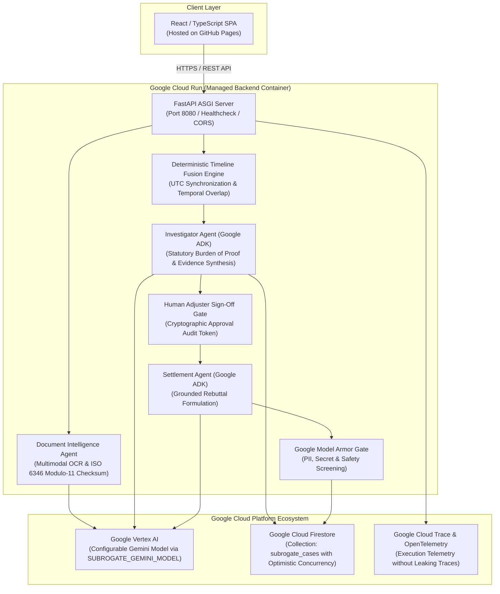

# SubroGate 🛡️
<p align="center">
  
</p>
### Agentic Incident Reconstruction for Cargo Disputes

[](https://opensource.org/licenses/Apache-2.0)
[](https://www.python.org/downloads/)
[](https://react.dev/)
[](https://cloud.google.com/run)
[](https://cloud.google.com/vertex-ai)
[](https://google.github.io/)

**SubroGate** is an enterprise-grade **Agentic Incident Reconstruction** platform designed for commercial freight transit disputes. Built with **Google Vertex AI (Gemini 3.5)**, **Google Agent Development Kit (ADK)**, **Google Model Armor**, **Google Cloud Firestore**, and **Google Cloud Run**, it fuses fragmented physical custody evidence (Equipment Interchange Receipts, Bills of Lading) and continuous IoT sensor telemetry (temperature, 3-axis shock G-force, GPS) into an audit-ready, mathematically deterministic reconstruction of the incident to determine responsibility.

---

## 🛑 Problem

Cargo loss, spoilage, and physical transit damage account for billions in disputed freight claims annually across multimodal shipping lanes. Today, subrogation adjusters face critical operational bottlenecks:

1. **Unstructured Paper & Timestamp Discrepancies**: Gate interchange receipts (EIRs) are often degraded PDFs, faxes, or handwritten physical slips recorded in disparate local time zones.
2. **Disconnected Telemetry**: Calibrated cold-chain sensors and 3-axis accelerometer loggers record continuous time-series data that is rarely mathematically correlated with legal custody handovers.
3. **Slow, Contentious Dispute Cycles**: Carriers default to boiler-plate denials ("Damage existed before pickup", "Notice was untimely", "Sensor was uncalibrated"), dragging claims into multi-month disputes.
4. **Data Leakage & Hallucination Risks**: Generic AI tools hallucinate liability, fabricate legal precedents, or leak sensitive profit margins and API keys during carrier correspondence.

---

## 💡 Solution

SubroGate provides an **evidence-backed, mathematically deterministic incident reconstruction pipeline** governed by controlled agentic autonomy:

- **Multimodal Document Intelligence**: Ingests scanned receipts, validates ISO 6346 Modulo-11 container checksums, and extracts damage remarks and custody timestamps.
- **Deterministic Timeline Fusion**: Standardizes all time series to UTC and mathematically computes Care, Custody, and Control (CCC) overlap at the earliest recorded breach ($T_{\text{breach}} > T_{\text{interchange}}$).
- **Statutory Burden-of-Proof Synthesis**: Grounded directly under the Carmack Amendment (*49 U.S.C. § 14706*) and Uniform Intermodal Interchange Agreement (*UIIA Section E.2*).
- **Human-in-the-Loop Sign-Off Gate**: Enforces mandatory adjuster review before any external demand or settlement agent unlocks.
- **Google Model Armor Security Screening**: Guards all outbound AI drafts against PII, confidential profit margins, API secrets, and prompt injection attacks.

---

## 🔄 Product Workflow

SubroGate guides the claims adjuster through a structured **5-Stage Workflow**:



1. **Evidence Ingestion**: Upload scanned EIRs (PDF/PNG/JPG) and calibrated IoT sensor CSV data.
2. **Reconstruction**: Reconstructs a synchronized chronological custody interval timeline.
3. **Assessment**: The Investigator Agent produces an evidence-backed assessment identifying the responsible carrier with statutory citations.
4. **Human Review**: The claims adjuster verifies the evidence, adjusts liability allocation ($0-100\%$), enters notes, and signs the cryptographic approval token (`SIG-AUTH-*`).
5. **Recovery**: The Settlement Agent unlocks to analyze carrier objections, formulate grounded rebuttals, and manage automated dispute negotiation rounds under Google Model Armor screening.

---

## 🏛️ Architecture



---

## 🤖 Core Agentic Capabilities

### 1. Investigator Agent (Google ADK + Vertex AI Gemini)
- **Multimodal Evidence Correlation**: Ingests extracted receipt data and sensor logs.
- **Mathematical Overlap**: Evaluates custody intervals against threshold breaches (e.g. shock pulse and thermal excursion).
- **Statutory Citations**: Applies strict prima facie carrier liability standards under the Carmack Amendment (*49 U.S.C. § 14706*) and UIIA rules.
- **Strict Legal Boundary**: Formulates an evidence-backed responsibility assessment with explicit confidence metrics ($0-100\%$) and legal disclaimers.

### 2. Settlement Agent (Google ADK + Model Armor)
- **Gated Execution**: Cannot be invoked until a human adjuster issues an explicit `APPROVED` audit token.
- **Defense Analysis**: Categorizes inbound motor carrier pushback (*Damage Before Pickup, Untimely Notice, Disputes Custody, Disputes Calibration*).
- **Verifiable Rebuttals**: Drafts formal responses referencing the clean origin EIR outgate remarks and continuous sensor data.
- **Negotiation Simulation**: Evaluates multi-turn counteroffers against pre-approved settlement floors and recovery targets.

---

## 🛡️ Security & Google Model Armor

1. **Data Leak Prevention**: Scans generated letters for SSNs, credit cards, confidential company profit margins, and API keys.
2. **Prompt Injection Defense**: Detects and flags adversarial instructions before outbound dispatch.
3. **Audit Privacy**: OpenTelemetry execution traces sanitize internal prompts and prevent model chain-of-thought traces from leaking into client views or public logs.

---

## 💻 Local Setup & Development

### 1. Prerequisites
- Python 3.11+ / 3.12+
- Node.js 18+ & npm

### 2. Backend Setup
```bash
# Clone the repository
git clone https://github.com/malicodes2/SubroGate.git
cd SubroGate

# Copy environment template
cp .env.example .env

# Install Python dependencies
pip install -r backend/requirements.txt

# Start backend server
python scripts/run_backend.py
```

### 3. Frontend Setup
```bash
# Install frontend dependencies
cd frontend
npm install

# Start Vite dev server
npm run dev
```

The frontend will be available at `http://localhost:5173` and proxy API calls to `http://localhost:8000`.

---

## ⚙️ Environment Variables

| Variable | Default | Description |
| :--- | :--- | :--- |
| `SUBROGATE_GEMINI_MODEL` | `gemini-3.5-flash` | Centralized eligible Google Gemini model name. |
| `SUBROGATE_ENV` | `production` | Runtime environment (`development`, `production`, `test`). |
| `SUBROGATE_PORT` | `8080` | Port for FastAPI server (supports dynamic Cloud Run `PORT`). |
| `GEMINI_API_KEY` | *(None)* | Google AI Studio API key (for local development). |
| `GOOGLE_CLOUD_PROJECT` | *(None)* | GCP Project ID (for Vertex AI & Firestore on Cloud Run). |
| `GOOGLE_CLOUD_LOCATION`| `us-central1` | GCP region for Vertex AI. |
| `SUBROGATE_USE_VERTEX` | `true` | Route through Vertex AI (Google ADK). |
| `CORS_ORIGINS` | `https://malicodes2.github.io,http://localhost:5173` | Allowed CORS origins (comma-separated). |

---

## 🚀 Production Deployment

### 1. Backend (Google Cloud Run)
```bash
# Authenticate with Google Cloud
gcloud auth login
gcloud config set project YOUR_PROJECT_ID

# Run deployment script
./scripts/deploy_cloud_run.sh
# (or scripts\deploy_cloud_run.bat on Windows)
```

### 2. Frontend (GitHub Pages)
1. In your GitHub repository, go to **Settings ➔ Secrets and variables ➔ Actions**.
2. Add secret `VITE_API_BASE_URL`: `https://subrogate-backend-xxx.a.run.app`.
3. Push to `main` (or run `.github/workflows/deploy.yml`).

---

## 🧪 Testing & Verification

```bash
# Run 112 automated unit & integration tests
python -m pytest backend/tests -v

# Run frontend typecheck & production build
npm run build --prefix frontend
```

---

## ⚠️ Known Limitations

- **GPS Multipath & Tunnels**: GPS coordinates in mountain passes, marine terminals, or urban canyons are subject to atmospheric drift; internal calibrated accelerometer and temperature logger timestamps remain authoritative.
- **Physical Signature Forensics**: Handwriting signature extraction verifies the presence and legibility of interchange clerk and driver signatures, but does not perform legal biometric signature authentication.
- **Judicial Disclaimer**: SubroGate produces forensic evidence packages for commercial freight claim adjusters and insurers; it does not replace licensed claims adjusters or legal counsel.

