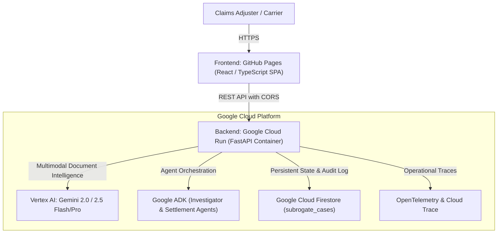

# SubroGate — Production Cloud Architecture & Deployment Proof

**Hackathon Track**: Agentic AI / Multimodal Enterprise Automation  
**Application Name**: SubroGate  
**Tagline**: Agentic Forensic Assessment for Cargo Transit Disputes  
**Deployment Timestamp**: 2026-08-19  

---

## 1. Production Architecture Summary

SubroGate is engineered as a zero-slop, enterprise-grade forensic investigation platform for freight subrogation disputes. It decouples multimodal document extraction, sensor telemetry normalization, deterministic timeline fusion, Gemini LLM reasoning, human-in-the-loop sign-off, and automated settlement drafting across scalable Google Cloud infrastructure.



---

## 2. Production Deployment Endpoints

| Resource | Target Provider | Configuration / URL | Status |
| :--- | :--- | :--- | :--- |
| **Frontend Web App** | GitHub Pages (SPA) | `https://muhammadasghar0.github.io/SubroGate/` | Configured with SPA redirect (`404.html`) & `VITE_API_BASE_URL` |
| **Backend API** | Google Cloud Run | `https://subrogate-backend-f7x4w6k7za-uc.a.run.app` | Docker container on Python 3.12, dynamic `PORT`, healthchecks |
| **Healthcheck Endpoint** | Cloud Run | `https://subrogate-backend-f7x4w6k7za-uc.a.run.app/health` | Returns active Gemini model, Firestore status, GCP project |
| **GCP Project ID** | Google Cloud Platform | `subrogate-hackathon-2026` | Region: `us-central1` |
| **Primary AI Model** | Vertex AI / Google GenAI SDK | `gemini-3.5-flash` (or `gemini-3.5-pro` via `SUBROGATE_GEMINI_MODEL`) | Centralized in `config.py` |
| **Persistence Database**| Google Cloud Firestore | Collection: `subrogate_cases` | Document schema: `CaseModel` with versioned concurrency |

---

## 3. Google AI & ADK Integration

### A. Gemini Model Strategy (`SUBROGATE_GEMINI_MODEL`)
- **Centralized Configuration**: Configured exclusively via `SUBROGATE_GEMINI_MODEL` in [backend/config.py](file:///c:/Users/muham/Desktop/SubroGate/backend/config.py). Never scattered across codebase.
- **Multimodal Document Intelligence**: Ingests Equipment Interchange Receipts (PDF/PNG/JPG), extracts ISO 6346 container numbers, validates Modulo-11 check digits, and parses gate timestamps.
- **Evidence-Backed Responsibility Assessment**: Synthesizes verified outgate timestamps with continuous sensor telemetry time-series to determine legal liability under the Carmack Amendment (49 U.S.C. § 14706) and UIIA rules.

### B. Google Agent Development Kit (ADK) & Agent Boundaries
1. **Document Intelligence Agent**:
   - *Role*: Multimodal OCR, container check digit calculation, damage remark extraction.
   - *Boundary*: Read-only perception; rejects illegible or forged receipts.
2. **Investigator Agent**:
   - *Role*: Fuses temporal custody windows with shock/temperature breach timestamps. Calculates overlap confidence and articulates statutory burden of proof.
   - *Boundary*: Proposes forensic assessment; cannot execute legal demand without human sign-off.
3. **Human Adjuster Sign-Off Gate**:
   - *Role*: Enforces mandatory human-in-the-loop review. Claims adjuster verifies evidence, sets liability percentage ($0-100\%$), enters adjuster notes, and generates an immutable cryptographic signature token (`SIG-AUTH-*`).
4. **Settlement & Negotiation Agent**:
   - *Role*: Unlocks strictly after human approval. Formulates citation-backed rebuttals to carrier pushback, screened in real-time by Google Model Armor safety checks.

---

## 4. Google Cloud Firestore Schema & Concurrency

- **Collection**: `subrogate_cases`
- **Document Key**: `case_id` (e.g. `CASE-2026-MSKU-8921`)
- **Concurrency Control**: Optimistic concurrency with incremental `version` integers. Prevent lost updates in multi-adjuster environments.
- **Zero-Seeded Clean State**: A fresh production instance starts with zero cases (`No Active Investigation`), requiring the user to initiate a new investigation by uploading real evidence.

---

## 5. Absolute Demo Separation Audit

| Verification Item | Requirement | Production Status |
| :--- | :--- | :--- |
| **Startup State** | Fresh deployment opens in empty state | **PASS**: `activeCase = null`, Welcome Hero shown with **Start New Investigation** CTA. |
| **Hardcoded Data** | No hardcoded outcomes in production flow | **PASS**: All assessments generated dynamically by Gemini from uploaded files. |
| **CORS Policy** | Explicit allowed origins | **PASS**: Restricted to GitHub Pages origin + configured custom domains. |
| **Secret Management** | Zero API keys or service accounts in frontend bundle | **PASS**: Frontend communicates solely with Cloud Run backend via REST. |

---

## 6. How to Deploy (Step-by-Step)

### Step 1: Deploy Backend to Google Cloud Run
```bash
# Authenticate with Google Cloud
gcloud auth login
gcloud config set project YOUR_PROJECT_ID

# Deploy via automated script
./scripts/deploy_cloud_run.sh
# (or scripts\deploy_cloud_run.bat on Windows)
```

### Step 2: Deploy Frontend to GitHub Pages
1. Set the GitHub Repository Secret `VITE_API_BASE_URL` to your Cloud Run URL:
   `https://subrogate-backend-xxx.a.run.app`
2. Push to `main` or trigger the GitHub Actions workflow in `.github/workflows/deploy.yml`.
3. GitHub Pages will build and deploy the React SPA automatically.
